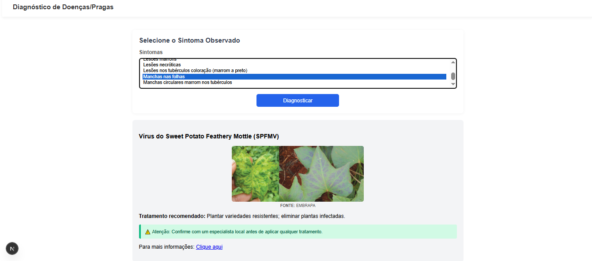

# Projeto Integrador
Projeto Integrador - Diagnóstico de Doenças da batata-doce

Este script faz parte do Projeto Integrador do curso e tem como objetivo auxiliar pequenos agricultores no diagnóstico de doenças da batata-doce, oferecendo informações claras e acessíveis sobre sintomas, causas e possíveis tratamentos.

A aplicação foi desenvolvida utilizando Next.js no front-end e integra funcionalidades como:
	•	 Base de dados de doenças/pragas – Informações sobre sintomas, prevenção ,tratamento e images para facilitar a identificação do doença.
# Tecnologias Utilizadas
	•	Frontend: Next.js, React, CSS Modules
	•	Backend: Node.js 
	•	Banco de Dados: MongoDB Atlas   
# Demonstração      

# Como Rodar o Projeto
	Clone o repositório

# Instale as dependências:
    npm install
# Configure as variáveis de ambiente:
	
	Adicione as credenciais do MongoDB  e chaves necessárias
# inicie o servidor de desenvolvimento:   
    npm run dev     
    Acesse em: http://localhost:3000    

# Objetivo do Projeto
O sistema busca ser um apoio tecnológico para pequenos produtores, permitindo:
	•	Reduzir perdas no cultivo da batata-doce;
	•	Facilitar a identificação de doenças de forma simples;
	•	Promover práticas agrícolas sustentáveis;
	•	Integrar tecnologia acessível ao dia a dia do campo.    

# Licença
Este projeto é de uso acadêmico e faz parte do Projeto Integrador.    